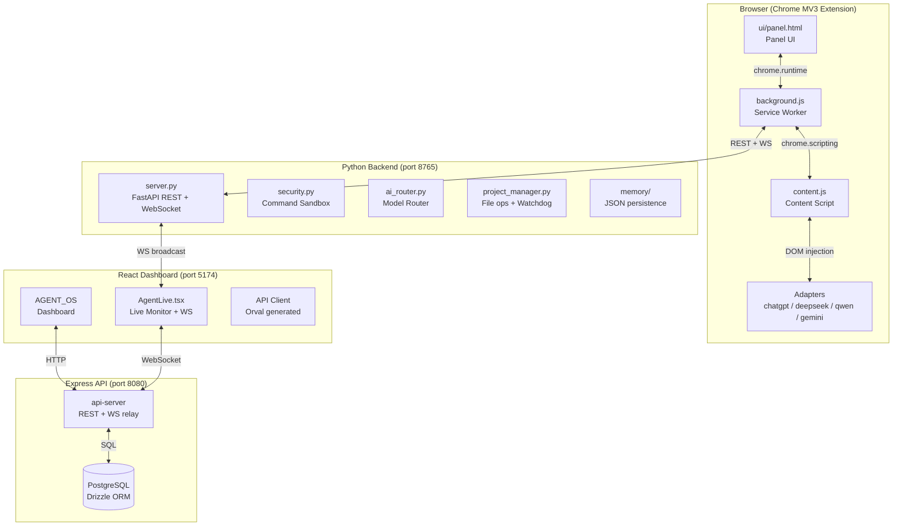
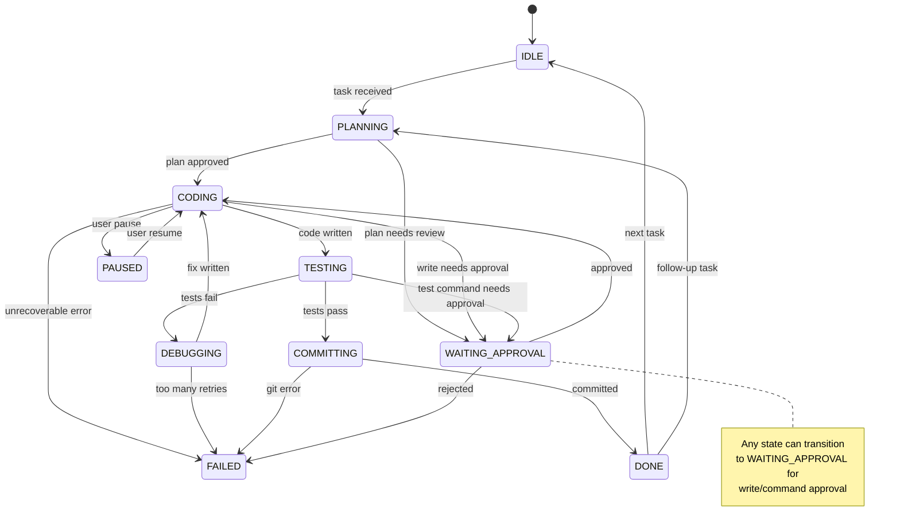
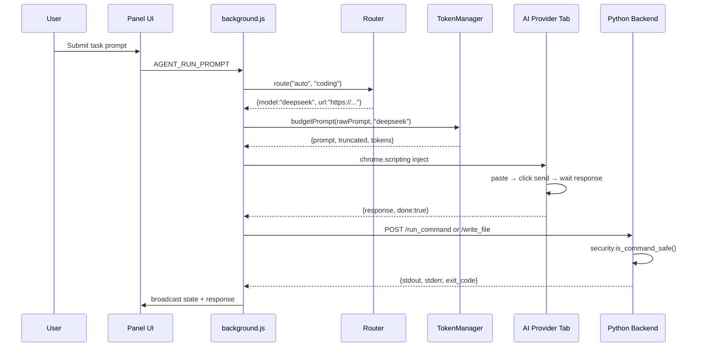
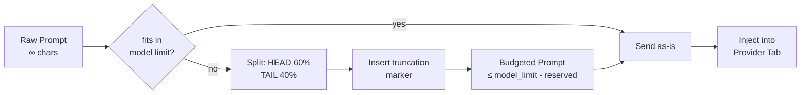
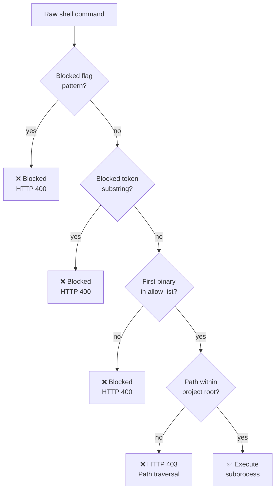

# Architecture — Multi-AI Autonomous Coding Agent

> Last updated: April 2026

## Overview

This project is a browser-based autonomous coding agent that drives four AI providers
(ChatGPT, DeepSeek, Qwen, Gemini) through Chrome's automation APIs, coordinated by a
local Python backend and a React dashboard.

---

## High-Level Component Map



---

## State Machine



---

## Request Lifecycle



---

## Token Budget Flow



---

## Security Model



---

## Directory Structure

```
ai-agent-extension/
├── extension/               # Chrome MV3 extension
│   ├── adapters/            # Per-provider DOM adapters (default exports)
│   │   ├── baseAdapter.js
│   │   ├── chatgpt.js
│   │   ├── deepseek.js
│   │   ├── qwen.js
│   │   └── gemini.js
│   ├── core/
│   │   ├── stateMachine.js  # IDLE→PLANNING→CODING→TESTING→DEBUGGING→COMMITTING→DONE
│   │   ├── router.js        # Task-to-provider routing
│   │   ├── tokenManager.js  # Prompt budgeting + truncation
│   │   ├── contextEngine.js # Sliding context window
│   │   ├── diffViewer.js    # Unified diff renderer
│   │   ├── toolRegistry.js  # Tool registration + dispatch
│   │   └── agentLoop.js     # Main agentic loop
│   ├── scripts/             # CLI audit/debug tools
│   │   ├── budget.mjs       # Token budget CLI
│   │   ├── check-selectors.mjs
│   │   ├── load-check.mjs
│   │   ├── package-check.mjs
│   │   └── snapshot-config.mjs
│   ├── ui/                  # Panel HTML/JS/CSS
│   ├── background.js        # Service worker
│   ├── content.js           # Content script
│   ├── config.json          # Central config (providers, routing, limits)
│   └── manifest.json        # MV3 manifest
│
├── backend/                 # Python FastAPI backend (port 8765)
│   ├── server.py            # 22+ REST endpoints + WebSocket /ws
│   ├── security.py          # Binary allow-list + token blocks
│   ├── project_manager.py   # File ops + watchdog watcher
│   ├── ai_router.py         # Model selection logic
│   ├── websocket_manager.py # WS connection manager
│   ├── file_indexer.py      # Directory indexer
│   └── memory/              # JSON memory persistence
│
├── docs/                    # Architecture docs (this file)
│
└── .github/                 # CI/CD
    ├── CODEOWNERS
    └── workflows/
        ├── ci.yml
        └── release.yml
```

---

## Provider Routing Matrix

| Task Type      | Primary  | Fallback Order                    | Reason                              |
|----------------|----------|-----------------------------------|-------------------------------------|
| `planning`     | ChatGPT  | DeepSeek → Gemini → Qwen          | Best at structured reasoning        |
| `coding`       | DeepSeek | ChatGPT → Gemini → Qwen           | Strongest code generation           |
| `debugging`    | Qwen     | DeepSeek → ChatGPT → Gemini       | Long code context + error analysis  |
| `long_context` | Gemini   | DeepSeek → ChatGPT → Qwen         | 32K+ token window                   |

---

## Checkpoint & Recovery

The background service worker saves a checkpoint every **5 seconds** to `chrome.storage.local`:

```json
{
  "state": "CODING",
  "pendingApprovals": [...],
  "config": {...},
  "savedAt": 1714000000000
}
```

On startup, the worker restores the last checkpoint and resumes from the saved state.
This ensures task continuity across browser crashes and extension reloads.

---

## Extension Permissions

| Permission       | Why                                              |
|------------------|--------------------------------------------------|
| `tabs`           | Open/find provider tabs                         |
| `storage`        | Checkpoint + config override persistence        |
| `scripting`      | Inject prompts + read responses from AI pages   |
| `activeTab`      | Focus the active provider tab                   |
| `http://localhost:8765/*` | Communicate with Python backend        |
| `ws://localhost:8765/*`   | WebSocket stream from backend          |
| `https://chatgpt.com/*` etc. | Read/write provider DOM            |
